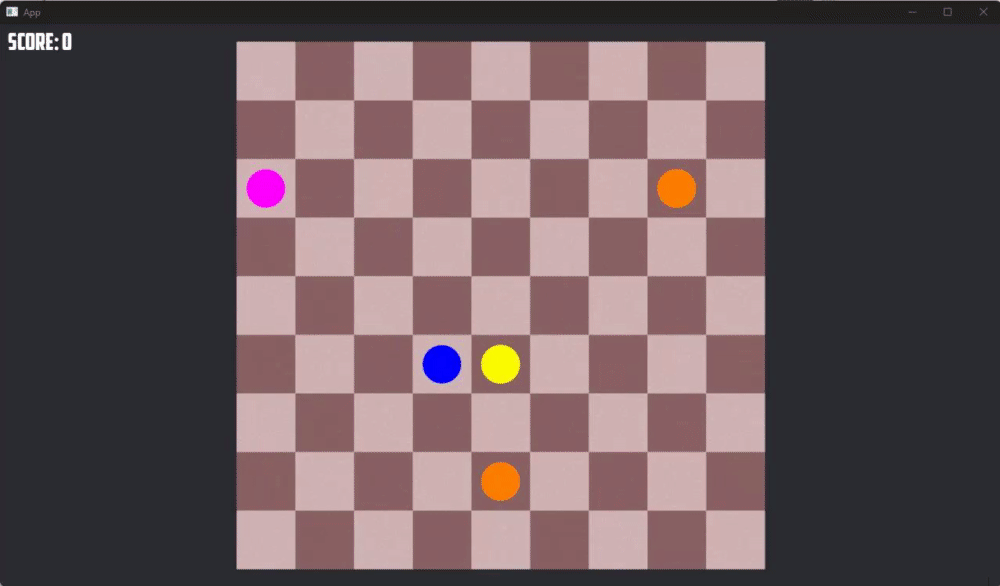

  
# 🎮 FIVE OR MORE
### *Learning to Play Using Deep Reinforcement Learning*

## 📅 PROJECT UPDATES / DEVELOPMENT LOG

A chronological record of the development, experiments, challenges, and progress of the **Five or More with AI** project.

### — [Change log ver 0.2]
**Date:** 2026-08-26
*Added functions to take state of the game, the state is to be converted to data in form of a 9x9 matrices.
*tested if the data are recorded properly.
*Few bug fixes.

###— [Change log ver 0.1]

**Date:** 2026-08-15

## **Today's Work**

*Fixed some game bugs, improved efficiency in board state for A* algorithm
*Start Learning about how to setup a RL Environment.

**Progress:** 🟢 Completed / 🟡 In Progress / 🔴 Blocked / 🔵 Experimentation

---5 or more game 🟡🔵

---

## 📌 EXECUTIVE SUMMARY
This project explores the application of Deep Reinforcement Learning (DRL) to the strategic board game **"Five or More."** By leveraging modern machine learning frameworks and system-level programming, we are engineering an intelligent AI agent capable of mastering gameplay strategy. The project addresses fundamental challenges of defining effective state representations and reward mechanisms in a highly stochastic environment.

### 👥 PROJECT INFO
- **Team Members:** Khumba Lunganlung, Kunal Kamod
- **Repository:** [GitHub](https://github.com/Kunal-Kamod25/Five-Or-More-With-AI)

## 🛠️ TECHNOLOGIES

  

- **Languages:** Python, Rust
- **Machine Learning:** PyTorch, NumPy
- **Tools & Vis:** Matplotlib, Git, Cargo, Pip

---

## 🎥 GAME VIDEO DEMONSTRATION
*(Placeholder for Game Video)*
> **Note:** The final trained agent will use mouse automation or a GUI interface to visually demonstrate its learned strategy here!

  

---

## ⚙️ SYSTEM WORKFLOW (How It Is Made)
The architecture operates on a continuous feedback loop:
1. **Game Environment** outputs the current state (9x9 grid layout and next balls).
2. The **State Representation** layer structures this for the Deep Neural Network.
3. The Network calculates **policy values** to select an Action (moving a ball to a target destination).
4. The environment executes the action, dispensing a **Reward** that loops back to optimize the agent's future decision-making.

---

## 🎯 EXPECTED OUTCOMES (What Outcomes This Will Give)
- 🤖 **Functional AI Agent:** Capable of autonomous, strategic gameplay.
- 💾 **Trained Model:** Serialized model capturing learned policies.
- 📊 **Performance Metrics:** Quantifiable improvement over random baselines, showing clear learning curves.

---

## ⚠️ CORE CHALLENGES
> *"Bad programmers worry about the code. Good programmers worry about data structures and their relationships."* — **Linus Torvalds**

* **Large State Space:** The game grid can have a vast number of permutations of colored balls, rendering traditional tabular Q-learning approaches impossible.
* **Random Ball Generation:** Stochastic elements introduce immense uncertainty, requiring the AI to learn generalized, adaptable strategies rather than memorized sequences.
* **Sparse Reward Function:** Rewards are only awarded when 5+ balls align. Designing intermediate tactical rewards is critical to successfully guide the agent's learning.

---

## 🚀 PROJECT OBJECTIVES
- **Develop an AI Agent:** Capable of autonomous, strategic gameplay.
- **Design the RL Environment:** Accurately simulating game mechanics (bridging Rust and Python).
- **Define State & Action Spaces:** Creating scalable mappings of the board to neural network inputs.
- **Train the Deep Learning Model:** Using robust DRL algorithms across an integrated Python/Rust architecture.
- **Evaluate & Improve:** Iteratively enhancing gameplay via performance evaluations and hyperparameter tuning.

   
  

