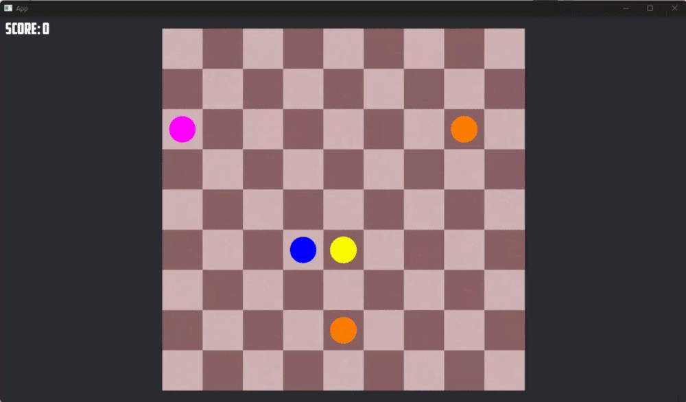

<div align="center">

# 🎮 FIVE OR MORE

### *Learning to Play Using Deep Reinforcement Learning*

**A Master's project exploring how a reinforcement learning agent can learn to play the Five or More / Color Lines puzzle game.**

[](https://www.python.org/)
[](https://pytorch.org/)
[](https://www.pygame.org/)
[](https://numpy.org/)
[](https://git-scm.com/)

</div>

---

## 📌 Project Overview

**Five Or More with AI** is a Deep Reinforcement Learning project focused on teaching an AI agent to play the **Five or More** puzzle game.

The game uses a **9×9 board** containing colored pieces. A player moves a piece through empty cells to create a contiguous line of **five or more pieces of the same color**. Matching lines are cleared and points are awarded, while new pieces are introduced as the game continues.

The long-term objective is to develop an agent that learns useful gameplay strategies from interaction with the environment rather than relying on a fixed, hand-written strategy.

---

## 🎯 Objectives

- Build a faithful and playable Five or More game.
- Represent the board in a form suitable for machine learning.
- Build a headless reinforcement learning environment around the same game logic.
- Define and validate the observation, action, and reward interfaces.
- Investigate a **CNN + DQN** approach for the spatial game state.
- Train and evaluate the agent against baseline strategies.
- Measure learning using reproducible experiments and gameplay metrics.
- Demonstrate the trained agent playing the game autonomously.

---

## 🎮 Current Game

The original prototype was implemented with **Rust + Bevy**. The active game has now been ported to **Python + Pygame** so that the game logic and future reinforcement learning environment can be developed in the same language.

The current Python implementation includes:

- 9×9 board
- Seven piece colors
- Random piece spawning
- A* pathfinding
- Horizontal, vertical, and diagonal line detection
- 5+ line clearing
- Native scoring rules
- Easy / Medium / Hard difficulty
- Start menu
- Current score and highest score
- Restart and quit controls
- Selected-piece visual feedback
- Piece movement animation
- Movement path visualization
- Game-over detection

The project is designed so that **game logic is separated from Pygame rendering and input handling**. This is important for reinforcement learning because training should run without depending on screenshots, mouse automation, or GUI rendering.

---

## 🧩 Game Rules

The Python implementation follows the core behavior established in the original game.

### Board

- **Size:** 9×9
- **Initial pieces:** 5
- **Piece colors:** 7
- **Maximum occupied cells:** 81

### Movement

- A piece can move only **horizontally or vertically**.
- Diagonal movement is not allowed.
- Occupied cells act as obstacles.
- **A\*** is used to find a path to an empty destination.

### Matching

A line is detected when **five or more contiguous pieces of the same color** are aligned in any of these directions:

- Horizontal
- Vertical
- Diagonal ↘
- Diagonal ↗

### Difficulty

After a normal move that does not create a match:

| Difficulty | New Pieces |
|---|---:|
| Easy | 1 |
| Medium | 2 |
| Hard | 3 |

### Scoring

| Line Length | Score |
|---:|---:|
| 5 | 10 |
| 6 | 12 |
| 7 | 14 |
| 8 | 16 |
| 9 | 18 |

---

## 🧠 Planned Reinforcement Learning Architecture

The current research direction is **CNN + DQN**.

The basic pipeline is:

```text
Current Game State
        ↓
9×9 Board Representation
        ↓
CNN
        ↓
Spatial Features
        ↓
DQN
        ↓
Q-values
        ↓
Legal-action filtering
        ↓
Selected source → destination move
        ↓
Game Environment
        ↓
Next State + Reward
        ↺
```

The **CNN** is intended to learn spatial patterns in the board, while the **DQN** will estimate the value of candidate actions.

This architecture is a planned research direction; training and final evaluation have not yet been completed.

---

## 🧱 Architecture

The project is organized around a separation between core game logic and presentation:

```text
                 ┌─────────────────┐
                 │    Pygame UI    │
                 │ Renderer/Input  │
                 └────────┬────────┘
                          │
                          ▼
                 ┌─────────────────┐
                 │      Game       │
                 │   Core Logic    │
                 └────────┬────────┘
                          │
          ┌───────────────┼────────────────┐
          ▼               ▼                ▼
      Board/Pieces     Movement        Match Logic
          │               │                │
          │              A*          Detection/Scoring
          └───────────────┼────────────────┘
                          │
                          ▼
                 ┌─────────────────┐
                 │  RL Environment │
                 │   (next phase)  │
                 └────────┬────────┘
                          │
                          ▼
                    CNN + DQN
```

The same core game state can therefore be used for both:

1. Human gameplay through Pygame.
2. Fast, headless reinforcement learning during training.

---

## 📁 Project Structure

```text
Five-Or-More-With-AI/
│
├── game/                     # Python game implementation and tests
│   ├── board.py
│   ├── piece.py
│   ├── board_pieces.py
│   ├── spawner.py
│   ├── movement.py
│   ├── line_detector.py
│   ├── scoring.py
│   ├── match_resolver.py
│   ├── game_over.py
│   ├── game.py
│   ├── state.py
│   ├── renderer.py
│   ├── input_controller.py
│   ├── main.py
│   └── test_*.py
│
├── data/                     # Experiment and generated data
├── docs/                     # Supporting documentation/media
├── experiments/              # Training and experiment outputs
├── Python_Programming/       # Supporting Python work
├── src/                      # Supporting project material
└── README.md
```

The old Rust implementation is no longer part of the active project tree. It is preserved separately as a reference/archive.

---

## 🧪 Testing

The Python implementation currently has a comprehensive component-level test suite.

Latest verified test run:

```text
109 tests
109 passed
0 failed
```

Tests cover:

- Board representation
- Piece management
- Piece spawning
- A* movement
- Line detection
- Scoring
- Match resolution
- Game flow
- Game-over behavior
- State encoding
- Input handling
- Renderer-related behavior

The tests are intentionally separated from exact random positions so that stochastic spawning does not make the suite brittle.

---

## 📅 Development Log

### Change Log — v0.5
**Date:** 2026-10-05

- Completed the main port from **Rust + Bevy** to **Python + Pygame**.
- Rebuilt the game as modular Python components.
- Implemented board and piece management.
- Implemented random spawning.
- Implemented A* movement and path visualization.
- Implemented horizontal, vertical, and diagonal line detection.
- Implemented scoring and match resolution.
- Implemented difficulty selection, menus, restart/quit controls, score tracking, and game-over handling.
- Validated the Python game with a 109-test suite.
- Selected **CNN + DQN** as the current AI architecture to investigate.

### Change Log — v0.4
**Date:** 2026-09-05

- Explored an early Python RL environment wrapper using Gymnasium.
- Investigated a 9×9 observation representation.
- Explored a source-to-destination action formulation.
- Added legal-action masking experiments.

### Change Log — v0.3
**Date:** 2026-08-28

- Added PyO3-based integration work between the Rust game and Python experimentation.
- Added live 9×9 board-state logging.
- Created a Python matrix viewer for inspecting game state.
- Prepared reinforcement-learning setup material.

### Change Log — v0.2
**Date:** 2026-08-26

- Added game-state extraction into 9×9 matrix form.
- Tested state recording.
- Fixed several game-state related bugs.

### Change Log — v0.1
**Date:** 2026-08-15

- Fixed early gameplay bugs.
- Improved board-state handling related to A* pathfinding.
- Started studying reinforcement learning environment design.

---

## ⚠️ Research Challenges

### Large State Space

A 9×9 board with multiple colors produces a very large number of possible configurations. This makes straightforward tabular Q-learning impractical for the full problem.

### Stochastic Gameplay

New pieces are introduced randomly, so the agent must learn strategies that remain useful across many different board configurations.

### Sparse Rewards

Line clearing provides a strong gameplay signal, but useful behavior can occur before a line is completed. Designing a reward function that encourages good long-term board management is therefore an important research problem.

### Large Action Space

A natural action representation is:

```text
source position → destination position
```

Many source-destination combinations are illegal in a given state. Efficient legal-action handling will therefore be important for training.

### Spatial Reasoning

The board is inherently spatial. The project will investigate whether convolutional layers can learn useful local and regional patterns more effectively than treating the board as a simple flat vector.

---

## 📊 Planned Evaluation

The trained agent will eventually be evaluated using measurable gameplay statistics such as:

- Average score per episode
- Maximum score
- Number of moves survived
- Game length
- Comparison against a random baseline
- Comparison against a simple rule-based baseline
- Training reward curves
- Performance across different difficulty settings

The exact evaluation protocol will be finalized after the RL environment and reward function are established.

---

## 🚀 Roadmap

```text
✅ Port game to Python
✅ Implement core game mechanics
✅ Build playable Pygame interface
✅ Add difficulty / menus / score tracking
✅ Add animation and path visualization
✅ Validate game with automated tests
⬜ Build headless RL environment
⬜ Finalize observation representation
⬜ Finalize action space
⬜ Design and test reward function
⬜ Implement random baseline
⬜ Implement CNN + DQN
⬜ Train the agent
⬜ Evaluate against baselines
⬜ Tune and compare experiments
⬜ Connect trained agent to the playable game
⬜ Final AI gameplay demonstration
```

---

## 👥 Team

**Team Members**

- Khumba Lunganlung
- Kunal Kamod

**Repository**

[GitHub](https://github.com/Kunal-Kamod25/Five-Or-More-With-AI)

---

## 🛠️ Technologies

<div align="center">


</div>

- **Language:** Python
- **Game:** Pygame
- **Machine Learning:** PyTorch
- **Numerical Computing:** NumPy
- **Testing:** Python `unittest`
- **Version Control:** Git / GitHub

---

## 🎥 Game Demonstration

A gameplay GIF/video will be added here as the visual demonstration of the completed game and, later, the trained AI agent.

<!-- Example:
<div align="center">
  
</div>
-->

---

## 🔭 Final Vision

The project ultimately aims to connect three layers:

```text
              GAME
               ↓
        REINFORCEMENT
          LEARNING
               ↓
         LEARNED POLICY
               ↓
       AUTONOMOUS PLAY
```

The final demonstration will show the trained agent selecting moves and playing Five or More through the same game logic used by the human-facing application.

---

<div align="center">

### 🤖 From Game Logic → Reinforcement Learning → Learned Strategy

*This repository documents the implementation, experiments, and evaluation of the project as it develops.*

</div>
