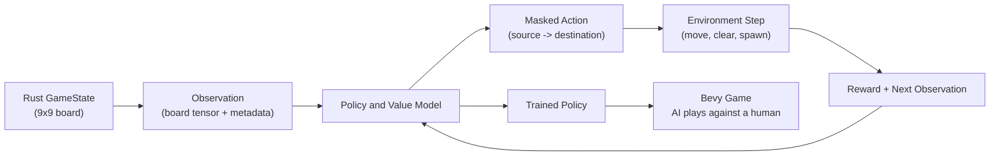

# Pipeline Diagram - RL Environment

This is the current end-to-end pipeline for training an agent on the
Five-or-More game.

## Notes on Each Stage

1. **Raw Human Games** — untouched game records from a public dataset
   (e.g. move-by-move logs of real human matches).
2. **Dataset** — the raw games converted into (board_state, next_move) pairs.
   Each pair is one training example: the feature (board) and the label
   (what the human did next).
3. **Model** — currently a black box. We know it takes a board in and
   produces a predicted move out. Internal architecture is Campaign 4.
4. **Training Loop** — repeatedly: show the model examples, measure how
   wrong its prediction was (loss), nudge its parameters to be less wrong.
   This is the only stage where "learning" happens.
5. **Trained Model** — same model, but now its parameters are frozen at
   values that (hopefully) generalize to boards it never saw.
6. **Inference** — feeding a brand new board (from a live game) through the
   frozen model to get a move prediction. No further learning happens here.
7. **Live App** — where inference actually gets used: a human plays against
   our trained model in real time.

## Where Overfitting Risk Lives
Between steps 4 and 5 — if training runs too long or the model is too
complex relative to the data, it can memorize the training games instead
of learning generalizable human tendencies. This is why we hold out a
validation/test set that's never used during training itself.
