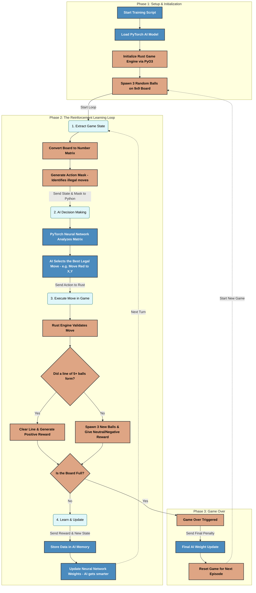

# Project Flow Diagram

This diagram explains the step-by-step Reinforcement Learning loop, showing exactly how the Rust game and the Python AI communicate every single turn.

```mermaid
graph TD
    %% Styling for visual clarity
    classDef rust fill:#dea584,stroke:#333,stroke-width:2px,color:black,font-weight:bold;
    classDef python fill:#4b8bbe,stroke:#333,stroke-width:2px,color:white,font-weight:bold;
    classDef data fill:#f9f9f9,stroke:#333,stroke-width:2px,stroke-dasharray: 5 5,color:black;
    classDef step fill:#e0f7fa,stroke:#006064,stroke-width:1px,color:black;

    %% Python Setup Phase
    subgraph Phase 1: Setup & Initialization
        A[Start Training Script]:::python --> B[Load PyTorch AI Model]:::python
        B --> C[Initialize Rust Game Engine via PyO3]:::rust
        C --> D[Spawn 3 Random Balls on 9x9 Board]:::rust
    end

    %% The RL Loop (Happens every single turn)
    subgraph Phase 2: The Reinforcement Learning Loop
        
        %% Step 1: Observation
        D --> |Start Loop| E(1. Extract Game State):::step
        E --> F[Convert Board to Number Matrix]:::rust
        F --> G[Generate Action Mask - Identifies illegal moves]:::rust
        
        %% Step 2: Decision
        G --> |Send State & Mask to Python| H(2. AI Decision Making):::step
        H --> I[PyTorch Neural Network Analyzes Matrix]:::python
        I --> J[AI Selects the Best Legal Move - e.g. Move Red to X,Y]:::python
        
        %% Step 3: Execution
        J --> |Send Action to Rust| K(3. Execute Move in Game):::step
        K --> L[Rust Engine Validates Move]:::rust
        L --> M{Did a line of 5+ balls form?}:::rust
        
        %% Step 4: Game Rules Logic
        M -- Yes --> N[Clear Line & Generate Positive Reward]:::rust
        M -- No --> O[Spawn 3 New Balls & Give Neutral/Negative Reward]:::rust
        
        %% Step 5: Game Over Check
        N --> P{Is the Board Full?}:::rust
        O --> P
        
        %% Step 6: Learning
        P -- No --> Q(4. Learn & Update):::step
        Q --> |Send Reward & New State| R[Store Data in AI Memory]:::python
        R --> S[Update Neural Network Weights - AI gets smarter]:::python
        
        %% Loop back
        S -.-> |Next Turn| E
    end

    %% End Game
    subgraph Phase 3: Game Over
        P -- Yes --> T[Game Over Triggered]:::rust
        T --> |Send Final Penalty| U[Final AI Weight Update]:::python
        U --> V[Reset Game for Next Episode]:::rust
        V -.-> |Start New Game| D
    end
```
